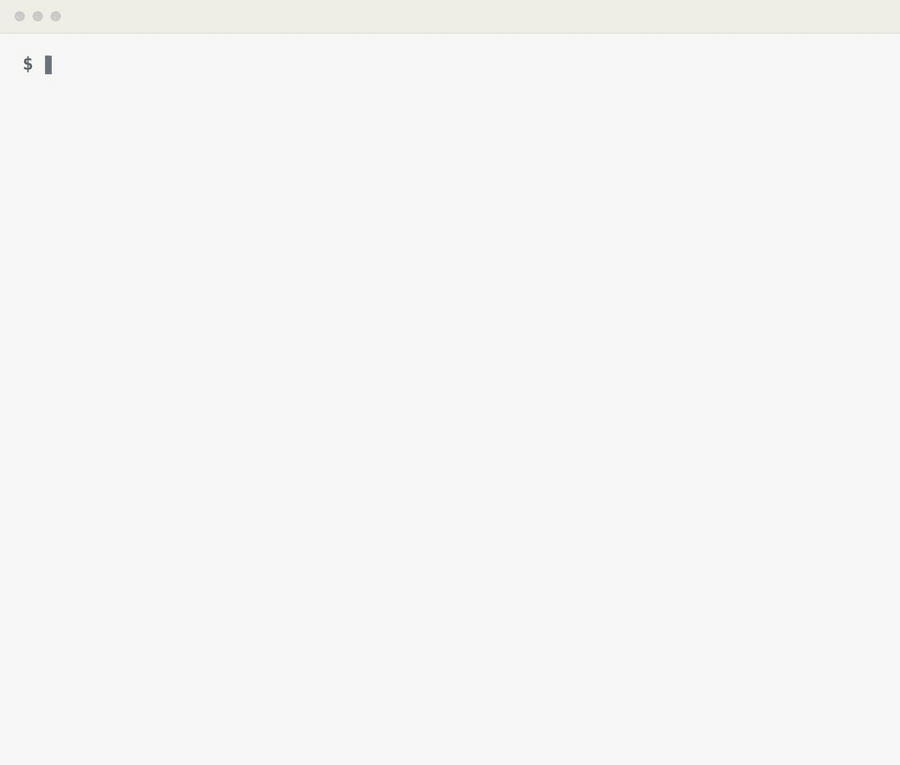

# 🤖 Pullover for AI agents

Let your agents check the inbox for you, instead of going and looking yourself:

> *"Hey Claude, check Pullover to see what's on my plate right now."*

They get the same classified inbox the window shows — which pull requests are waiting on you and why, how long each has been your move, and where it lives on github.com. No second GitHub token, no polling of their own, no copy of the rules. They can also park a pull request until it wakes, which is the one thing your GitHub tooling cannot do:

> *"Snooze everything from acme/infra until tomorrow."*

<p align="center">
  
</p>

## 🔛 Turn it on

The server is off until you say otherwise. Open **Settings** in Pullover and turn on **MCP server**. The address appears under the switch; that is the one to give your client.

## 🔌 Connect a client

<details>
<summary>⌨️ <b>Claude Code</b></summary>

One command:

```bash
claude mcp add --transport http pullover http://127.0.0.1:7855/mcp
```

</details>

<details>
<summary>⌨️ <b>Codex CLI</b></summary>

In `~/.codex/config.toml`:

```toml
[mcp_servers.pullover]
url = "http://127.0.0.1:7855/mcp"
```

</details>

<details>
<summary>🖱 <b>Cursor</b></summary>

In `~/.cursor/mcp.json`, or `.cursor/mcp.json` inside a project:

```json
{
  "mcpServers": {
    "pullover": {
      "url": "http://127.0.0.1:7855/mcp"
    }
  }
}
```

</details>

<details>
<summary>🖥 <b>Claude Desktop</b></summary>

Its connectors are dialled from Anthropic's servers rather than from your Mac, so they cannot reach an address on it. `mcp-remote` runs locally and does the reaching. In **Settings**, under *Desktop app*, open **Developer** and press **Edit config**. Put this in `claude_desktop_config.json`, then restart the app:

```json
{
  "mcpServers": {
    "pullover": {
      "command": "npx",
      "args": ["-y", "mcp-remote", "http://127.0.0.1:7855/mcp", "--allow-http"]
    }
  }
}
```

</details>

<details>
<summary>🧩 <b>Anything else that speaks Streamable HTTP</b></summary>

The same URL, with no token and no header to set:

```
http://127.0.0.1:7855/mcp
```

</details>

## 🧰 What your agent can do

| Tool | What it does |
| --- | --- |
| `get_inbox` | The sections you see in the window, longest wait first |
| `snooze_pull_request` | Parks one for a number of hours, or until it wakes |
| `unsnooze_pull_request` | Brings it back |

**`get_inbox`** carries, for each pull request, the reason Pullover put it there, its CI state, its place in a stack, and its link. It refreshes from GitHub when the last fetch is over a minute old — the same rule the window uses — so an agent and a click see the same thing.

**`snooze_pull_request`** without hours parks a pull request until it wakes on its own: a reply in a review thread you took part in, or a new commit. Finished work needs no snooze — once your reply lands on GitHub, Pullover reclassifies it by itself.

> [!NOTE]
> **Nothing an agent does through Pullover reaches GitHub.** It reads, and a snooze is a private note on your Mac that nobody else sees. To reply, approve or merge, an agent uses its own GitHub tooling, at the link Pullover gave it.

## 🔐 Local and private

The server binds to `127.0.0.1` and nothing else. It refuses any request that did not come from a program on this Mac, which includes a web page in your browser being pointed at the loopback address.

What it serves is the inbox the window is built from: pull requests you are involved in, with a few fields the card does not print, such as the base branch and the exact timestamps. Any local program that can read your GitHub credentials could already fetch all of that from GitHub itself, which is why version one has no token. If that ever stops being true for your setup, turn the switch off.

## ❤️ Enjoying Pullover?

You read a page about MCP servers to the end, so this was built for you. Pullover is free, with no company behind it and no backend to pay for: [a star on the repo](https://github.com/omgovich/pullover) costs nothing, and [sponsoring](https://github.com/sponsors/omgovich) buys the evenings that keep it growing.
