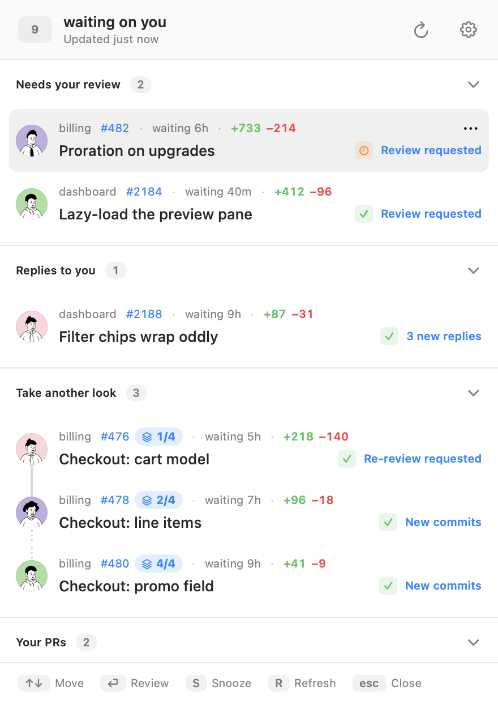
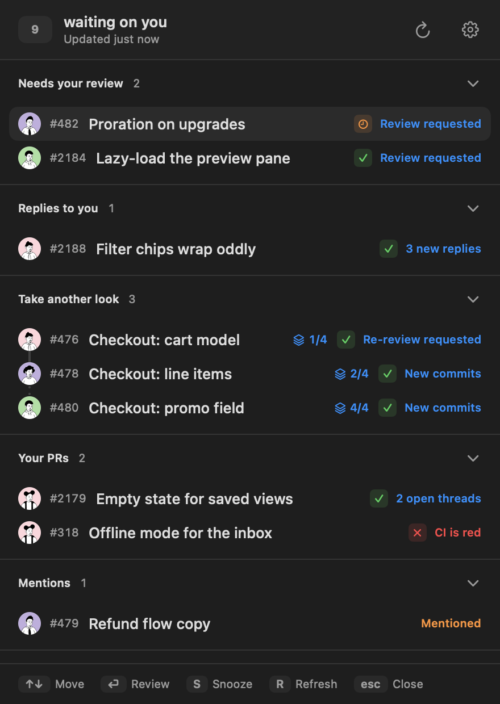

<p align="center">
  
</p>

<h1 align="center">Pullover</h1>

<p align="center"><b>Your code-review inbox, in the macOS menu bar.</b><br />Only the pull requests that need <i>you</i> — everything you're waiting on stays hidden.</p>

<p align="center">
  <a href="https://github.com/omgovich/pullover/releases/latest"></a>
</p>

<p align="center">
  <a href="https://github.com/omgovich/pullover/releases/latest"></a>
  <a href="https://github.com/omgovich/pullover/actions/workflows/ci.yml"></a>
  <a href="LICENSE"></a>
</p>

<p align="center">
  
  
</p>

---

GitHub notifications bury the one thing that matters — *whose move is it?* Pullover answers exactly that. It watches the repos you review in and keeps a short, honest inbox: if a PR shows up, it's waiting on you; if it doesn't, you're free.

## ✨ Features

- 🎯 **Only what needs you.** Review requests, re-reviews, replies you owe, mentions — each PR sits under the reason it's there, longest wait first. The ones waiting on somebody else collapse into their own section.
- 🧑‍💻 **Your own PRs, too.** They surface only when there's something for you to do: changes requested, a comment you haven't answered, red CI, merge conflicts, or approved and ready to merge.
- 🔒 **Private repos and team requests.** Both land in the inbox like anything else — nothing to configure.
- 🧬 **Stacks stay together.** A stacked PR shows its place in the chain (`4/8`), and the stack is drawn as one connected run.
- 💤 **Snooze until new activity.** Park a PR and it comes back on its own — a new push, or a reply in a thread you're in.
- 📌 **Lives in the menu bar.** A quiet count of PRs waiting on you; no Dock icon, no window to manage.
- ⚡ **Open it from anywhere.** One keystroke — `⌃⌥P` — and the inbox is in front of you, whatever app you're in.
- ⌨️ **Drive it from the keyboard.** Get through the list without reaching for the mouse.
- 🌗 **Light, dark, roomy or dense.** Follows your macOS appearance out of the box, and can pack down to one row per PR when your list gets long.
- ⬇️ **Updates itself quietly.** New versions download in the background; Pullover then offers a restart and waits for you to take it.
- 👀 **Read-only by design.** Pullover never comments, approves, or merges. Clicking a PR opens it on github.com — you act where you always did.
- 🤖 **Talks to your agents.** An optional MCP server, local to your Mac, lets Claude Code and other agents ask which PRs are waiting on you and why — and park the ones that can wait — from the same inbox you see, with no extra GitHub token.

## 📦 Install

> [!TIP]
> **[⬇️ Download the latest release](https://github.com/omgovich/pullover/releases/latest)** — one universal build for Apple Silicon and Intel. Signed and notarized, so it just opens.

Drag Pullover into Applications and launch it.

Sign in with GitHub and you're done — out of the box Pullover watches every repo you're involved in. If that's too much, narrow it down to specific repos in **Settings**.

<details>
<summary><b>🛠️ Running from source</b></summary>

### 1. Register a GitHub OAuth App

Release builds ship with a built-in OAuth client ID, but a from-source build needs its own. Pullover signs you in with GitHub's Device Flow, so it needs an OAuth App. You only do this once, and it takes about two minutes.

1. Go to https://github.com/settings/developers and pick the **OAuth Apps** tab — not GitHub Apps, they're a different thing and won't work here.
2. Click **New OAuth App** and fill in:
   - **Application name** — `Pullover`
   - **Homepage URL** — anything valid; Device Flow never opens it.
   - **Application description** — optional, and it's what shows on the authorization screen. Suggested:

     > A menu-bar inbox that shows only the pull requests waiting on you, and hides the ones where you're waiting on someone else. Reads only — it never comments, reviews, or merges anything.

   - **Redirect URI** — unused by Device Flow. `http://localhost` if you want one at all. Leave **Allow wildcard matching** off.
3. Tick **Enable Device Flow**. Easy to miss, and without it sign-in fails with `unauthorized_client`.
4. Leave **Expire user access tokens** OFF. It hands out an 8-hour token plus a `refresh_token`, and Pullover doesn't implement refresh — you'd be silently signed out every few hours, and because the app doesn't tell a 401 apart from a network blip it would sit there showing a stale list and an error instead of sending you back to sign in.
5. Click **Register application**, then copy the **Client ID**. You don't need the client secret — Pullover is a public client and never asks for one.

### 2. Point Pullover at it

```bash
cp .env.example .env
```

Paste the Client ID into `MAIN_VITE_GITHUB_CLIENT_ID`. It's read at build time, so restart `npm run dev` after changing it.

### 3. Run it

```bash
npm install
npm run dev
```

Click the menu-bar item, hit **Sign in with GitHub**. Pullover shows you a short code, copies it to your clipboard and opens the browser — paste it, approve, and the window fills in.

### Development

- `npm test` — unit tests (all the classification logic lives in `src/core/`) and screenshot tests
- `npm run test:visual` — screenshot tests alone. They render components in a real Chromium and compare against committed PNGs, so they need `npx playwright install chromium` once. Re-record with `npm run test:visual -- -u`.
- `npm run typecheck` — type checking
- `npm run lint` — lint + formatting check ([Biome](https://biomejs.dev), config in `biome.json`)
- `npm run lint:fix` — apply every safe lint fix and reformat
- `npm run dist` — local build into `dist/`. It signs with whatever Developer ID sits in your keychain, or not at all if there is none; either way it is not notarized, so a local build moved out of `dist/` may need `xattr -dr com.apple.quarantine` before it will launch. Released builds are notarized in CI.

</details>

## 🤖 For agents

Pullover can serve its inbox to AI agents over the [Model Context Protocol](https://modelcontextprotocol.io). It is off by default: turn on **MCP server** in Settings, then connect your client to `http://127.0.0.1:7855/mcp`. For Claude Code, Settings has a button that copies the whole command:

```bash
claude mcp add --transport http pullover http://127.0.0.1:7855/mcp
```

Any client that speaks Streamable HTTP works the same way — point it at that URL, no token, no headers.

The agent gets three tools. `get_inbox` returns the sections you see, each PR with the reason it is there and since when. `snooze_pull_request` and `unsnooze_pull_request` park a PR and bring it back, exactly as the context menu does — useful for "put everything from that repo aside until tomorrow", which is tedious by hand.

Nothing an agent does through Pullover reaches GitHub. A snooze is a note on this Mac that only Pullover reads; to actually reply, approve or merge, an agent uses its own GitHub tooling, at the link Pullover gives it.

The server listens on `127.0.0.1` only and refuses requests that did not come from this machine. The tool answers from Pullover's last fetch and refreshes first when that is more than a minute old, the same rule the window uses when you open it.

## 🔐 Privacy

Pullover has no backend. There's no server in the middle, no account to create, no analytics, no telemetry, no crash reporting — the app talks to exactly one place, GitHub's API, straight from your Mac. The optional MCP server listens on this Mac only, is off until you turn it on, hands out nothing you could not already see in the window, and lets an agent change nothing but Pullover's own snooze list. Your OAuth token never leaves the machine: it's encrypted via the macOS Keychain (Electron's `safeStorage`) and stored locally. And you don't have to take anyone's word for any of this — the entire app is open source, right here in this repo.

Pullover only ever reads — never a comment, a review, or any other write. Sign-in asks for `repo` and `read:org`, the narrowest scopes GitHub offers that can still see pull requests in private repositories and review requests that arrived through a team; if your organisation restricts third-party OAuth Apps, an owner has to approve Pullover under **Settings → Third-party Actions Access** before those repos show up.
