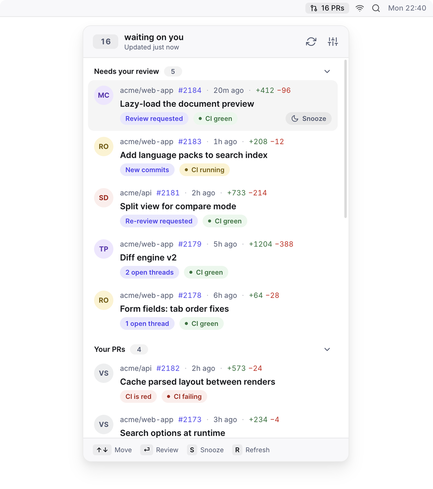

<p align="center">
  
</p>

<h1 align="center">Pullover</h1>

<p align="center"><b>Your code-review inbox, in the macOS menu bar.</b><br />Only the pull requests that need <i>you</i> — everything you're waiting on stays hidden.</p>

<p align="center">
  <a href="https://github.com/omgovich/pullover/releases/latest"></a>
  <a href="https://github.com/omgovich/pullover/actions/workflows/ci.yml"></a>
  <a href="LICENSE"></a>
</p>

<p align="center">
  
</p>

---

GitHub notifications bury the one thing that matters — *whose move is it?* Pullover answers exactly that. It watches the repos you review in and keeps a short, honest inbox: if a PR shows up, it's waiting on you; if it doesn't, you're free.

## ✨ Features

- 🎯 **Only what needs you.** Fresh review requests, re-reviews after new commits, unanswered comment threads, mentions — each PR lands in the inbox with the reason it's there. PRs where the ball is in someone else's court stay out of sight.
- 🧑‍💻 **Your own PRs, too.** They surface only when there's something for you to do: changes requested, a comment you haven't answered, red CI, or approved and ready to merge.
- 💤 **Snooze that un-snoozes itself.** Park a PR for a while — it wakes up on its own when something actually happens: new commits or a new reply.
- 📌 **Lives in the menu bar.** A quiet count of PRs waiting on you; no Dock icon, no window to manage.
- 👀 **Read-only by design.** Pullover never comments, approves, or merges. Clicking a PR opens it on github.com — you act where you always did.
- 🔒 **Private repos and team review requests** work out of the box (that's what the `repo` and `read:org` scopes are for — details below).

## 📦 Install

Download the `.dmg` from the [latest release](https://github.com/omgovich/pullover/releases/latest) and drag Pullover into Applications — one build, works on both Apple Silicon and Intel Macs.

The builds aren't signed or notarized (there's no Apple Developer account behind the project yet), so macOS quarantines them on download. Clear the flag once and it launches normally from then on:

```bash
xattr -dr com.apple.quarantine /Applications/Pullover.app
```

Alternatively, launch it once, let macOS refuse, then approve it under System Settings → Privacy & Security → "Open Anyway".

Sign in with GitHub and you're done — out of the box Pullover watches every repo you're involved in. If that's too much, narrow it down to specific repos in **Settings**.

<details>
<summary><b>🛠️ Running from source</b></summary>

### 1. Register a GitHub OAuth App

Release builds ship with a built-in OAuth client ID, but a from-source build needs its own. Pullover signs you in with GitHub's Device Flow, so it needs an OAuth App. You only do this once, and it takes about two minutes.

1. Go to https://github.com/settings/developers and pick the **OAuth Apps** tab — not GitHub Apps, they're a different thing and won't work here.
2. Click **New OAuth App** and fill in:
   - **Application name** — `Pullover`
   - **Homepage URL** — anything valid; Device Flow never opens it.
   - **Application description** — optional, and it's what shows on the authorization screen. Suggested:

     > A menu-bar inbox that shows only the pull requests waiting on you, and hides the ones where you're waiting on someone else. Reads only — it never comments, reviews, or merges anything.

   - **Redirect URI** — unused by Device Flow. `http://localhost` if you want one at all. Leave **Allow wildcard matching** off.
3. Tick **Enable Device Flow**. Easy to miss, and without it sign-in fails with `unauthorized_client`.
4. Leave **Expire user access tokens** OFF. It hands out an 8-hour token plus a `refresh_token`, and Pullover doesn't implement refresh — you'd be silently signed out every few hours, and because the app doesn't tell a 401 apart from a network blip it would sit there showing a stale list and an error instead of sending you back to sign in.
5. Click **Register application**, then copy the **Client ID**. You don't need the client secret — Pullover is a public client and never asks for one.

### 2. Point Pullover at it

```bash
cp .env.example .env
```

Paste the Client ID into `MAIN_VITE_GITHUB_CLIENT_ID`. It's read at build time, so restart `npm run dev` after changing it.

### 3. Run it

```bash
npm install
npm run dev
```

Click the menu-bar item, hit **Sign in with GitHub**. Pullover shows you a short code, copies it to your clipboard and opens the browser — paste it, approve, and the window fills in.

### Development

- `npm test` — unit tests (all the classification logic lives in `src/core/`)
- `npm run typecheck` — type checking
- `npm run lint` — lint + formatting check ([Biome](https://biomejs.dev), config in `biome.json`)
- `npm run lint:fix` — apply every safe lint fix and reformat
- `npm run dist` — local unsigned build; clear the quarantine flag before the first launch (see [Install](#-install)) if you move it out of `dist/`.

</details>

## 🛡️ About the permissions it asks for

At sign-in Pullover requests two scopes:

- **`repo`** — to read pull requests in private repositories. If everything you review is public, this is more than strictly needed, but GitHub has no narrower read-only scope that covers private PRs.
- **`read:org`** — so that review requests that reached you through a team, rather than by name, still show up.

Pullover only ever reads. It never writes a comment, review, or anything else.

If a repo belongs to an organisation that restricts third-party OAuth Apps, its pull requests won't appear until an org owner approves Pullover under **Settings → Third-party Actions Access** for that org.

## 🔐 Privacy

Pullover has no backend. There's no server in the middle, no account to create, no analytics, no telemetry, no crash reporting — the app talks to exactly one place, GitHub's API, straight from your Mac. Your OAuth token never leaves the machine: it's encrypted via the macOS Keychain (Electron's `safeStorage`) and stored locally. And you don't have to take anyone's word for any of this — the entire app is open source, right here in this repo.
